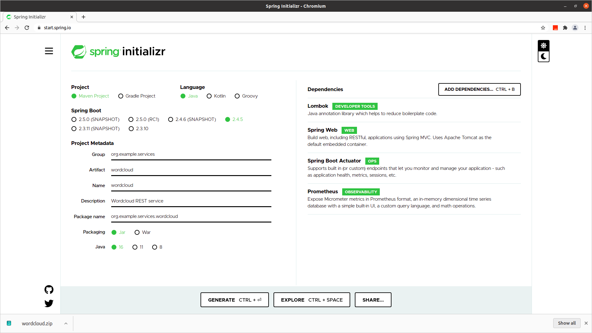

# wordcloud
Wordcloud REST service

## Requirements
* git client
* openjdk version "16"
* Optional: Apache Maven 3.8.1
* Optional: IntelliJ IDEA Ultimate (ideaIU-2021.1.1.tar.gz)

## Build app
```
$ git clone git@github.com:eg5846/wordcloud.git

$ cd wordcloud

$ ./mvnw clean test install
```

## Run app
See: https://docs.spring.io/spring-boot/docs/current/reference/htmlsingle/#using-boot-running-your-application
```
# Variant A
$ java -jar target/wordcloud-0.0.1-SNAPSHOT.jar

# Or variant B
$ ./mvnw spring-boot:run
```

## Use app
```
TODO: Add this
```

## Monitor and manage app
See: https://docs.spring.io/spring-boot/docs/current/reference/htmlsingle/#production-ready
```
# Endpoint examples (there are many more, but not enabled and exposed by default over http)

$ curl http://localhost:8080/actuator/health
{"status":"UP"}
```

## Goals
* Learn using IntelliJ IDEA and it's shortcuts
* What are the differences between ideaIC an ideaIU? See: https://www.jetbrains.com/de-de/idea/download/#section=linux
* Get started with Spring (Boot) and REST
* Get startet with Spring micrometers
* Learn about Lombok
* Create docker image for Spring application
* Implement example wordcloud REST service
* Use AssertJ
* Use SonarLint plugin

## References
* https://docs.spring.io/spring-boot/docs/current/reference/htmlsingle/
* See: [HELP.md](HELP.md)
* https://assertj.github.io/doc/

## Starting Spring Boot project
See: https://www.jetbrains.com/lp/intellij-frameworks/  
Here https://start.spring.io/ is used.  

See also: https://maven.apache.org/guides/mini/guide-naming-conventions.html#:~:text=artifactId%20is%20the%20name%20of,the%20jar%20as%20it's%20distributed.  
Next: Unzip wordcloud.zip

## RESTful machine interface
```
POST /wordcloud/from
Consumes: application/json
[
  ["紅樓夢", 6],
  ["賈寶玉", 3],
  ["林黛玉", 3],
  ["薛寶釵", 3],
  ["王熙鳳", 3],
  ["李紈", 3],
  ["賈元春", 3],
  ["賈迎春", 3],
  ["賈探春", 3],
  ["賈惜春", 3],
  ["秦可卿", 3],
  ["賈巧姐", 3],
  ["史湘雲", 3],
  ["妙玉", 3],
  ["賈政", 2],
  ["賈赦", 2],
  ["賈璉", 2],
  ["賈珍", 2],
  ["賈環", 2],
  ["賈母", 2],
  ["王夫人", 2],
  ["薛姨媽", 2],
  ["尤氏", 2],
  ["平兒", 2],
  ["鴛鴦", 2],
  ["襲人", 2],
  ["晴雯", 2],
  ["香菱", 2],
  ["紫鵑", 2],
  ["麝月", 2],
  ["小紅", 2],
  ["金釧", 2],
  ["甄士隱", 2],
  ["賈雨村", 2],
  ["foo", 1],
  ["bar", 1]
]
Produces: image/png
```

## TODOs
* Read references above
* Enable and expose monitoring endpoints over http (especially actuator and prometheus metrics)
* Add javadoc comments
* What does @SpringBootTest?
* How to use @NonNull? Use it from lombok or spring boot?
